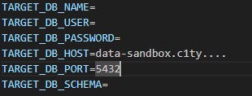
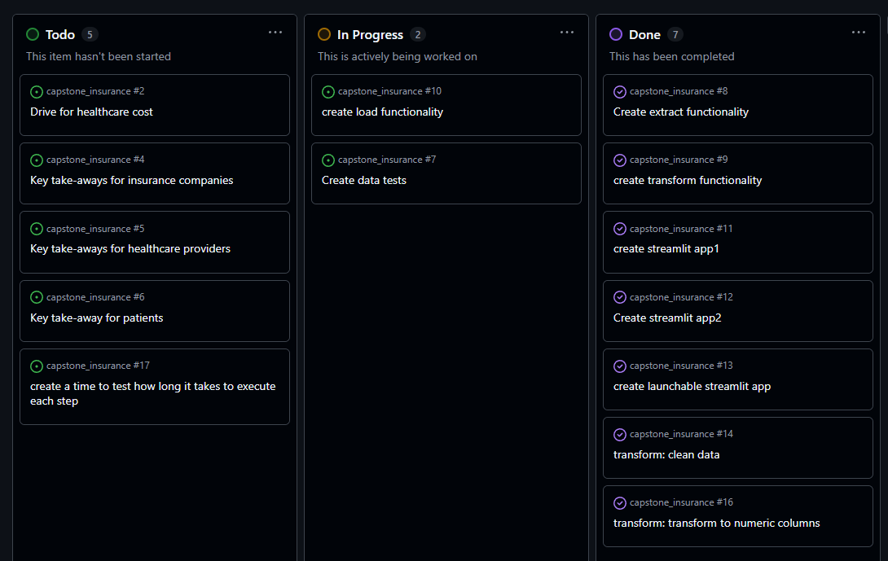

# Medical Insurance Cost Prediction – ETL Pipeline
This project demonstrates an ETL (Extract, Transform, Load) pipeline built around the Medical Insurance Cost Prediction dataset.
The dataset contains demographic and lifestyle information (age, sex, BMI, children, smoking status, region) along with medical insurance charges.

## Dataset
Data can be accessed on [Kaggle](https://www.kaggle.com/datasets/mohankrishnathalla/medical-insurance-cost-prediction/data).


### Set-up
- Clone the repository  
  ```bash
  git clone https://github.com/Rokyr/capstone_insurance

- Create a virtual environment  
  ```bash
  python -m venv venv
  source .venv/Scripts/activate 

- Install modules: 
  ```bash
  pip install -r requirements.txt

- Download the dataset and place the csv in the data/raw directory
- Create `.env.test` and `.env.dev` files in the root of the repository.  
These files should contain the following structure and are used to load 
the data into a database of your choice:



--- 

### Usage
The following terminal commands are available for working with the project. As it stands test and dev environments are the same:


- **run_etl test**  
Executes the ETL pipeline in a test environment
- **run_etl dev**  
Executes the ETL pipeline in the development environment.
***
- **run_app**  
Launches the Streamlit dashboard application for interactive exploration and analysis.
***
- **run_tests unit**  
Runs the unit test suite to validate individual functions and modules.
- **run_tests all**  
Executes all available tests (unit, integration, and component) to ensure full coverage.
- **run_tests integration**  
Runs integration tests to check how different parts of the system work together.
- **run_tests component**  
Runs component tests to verify larger sections of the pipeline or application.
***

- **flake8 .**  
Runs linting checks across the codebase to enforce style and identify potential issues.

---

# 1. Project Goals
- Identify key drivers of insurance costs and quantify their impact.
- Learn how to develop a fully functional ETL pipeline to clean, transform, and load data onto a database.
- Design an interactive dashboard to explore and assess correlations between variables.
- Create a comprehensive analysis dashboard that presents insights in a clear, user‑friendly way.

---
# 2. Choice of Data

## Rich Feature Set
The dataset includes attributes such as age, sex, BMI, number of children, smoking status, and region. These provide a balanced mix of socioeconomic and clinical indicators, making it suitable for both exploratory analysis and predictive modelling, which shall be on the agenda next.

## Potential for Correlation and Risk Analysis
The combination of demographic, lifestyle, and cost variables allows for building dashboards that highlight correlations, risk scores, and utilisation patterns.

---
# 3. ETL
The pipeline is designed to:
- Extract from csv file.
- Transform the data by cleaning, validating, and engineering features.
- Load the processed data into a structured format for streamlit application and a database. 

### Kanban


# 4. Challenges and Takeaways

- **Difficult to come up with tests**  
Designing meaningful unit, integration, and component tests was challenging, it took me long time to get my head round some of the tests.

- **Data quality and preprocessing**  
Not all data was numeric and it is difficult to convert some of the non linear data for better correlation analysis.

- **Building ETL**  
Building a robust ETL pipeline that may load files into a database.

# 5. Future Dev

- **ML predictive modeling pipeline**  
  Extend the project beyond exploratory analysis by building a machine learning pipeline that predicts insurance costs based on demographic and lifestyle factors. 

- **Expand test coverage**  
Develop more comprehensive unit, integration, and component tests to cover edge cases and ensure pipeline reliability.

- **Environment separation**  
Refine .env.test and .env.dev configurations to better distinguish between testing, development, and production environments.

- **Enhanced dashboards**  
Add more interactive features to the Streamlit app, such as guess the more influential factor.


